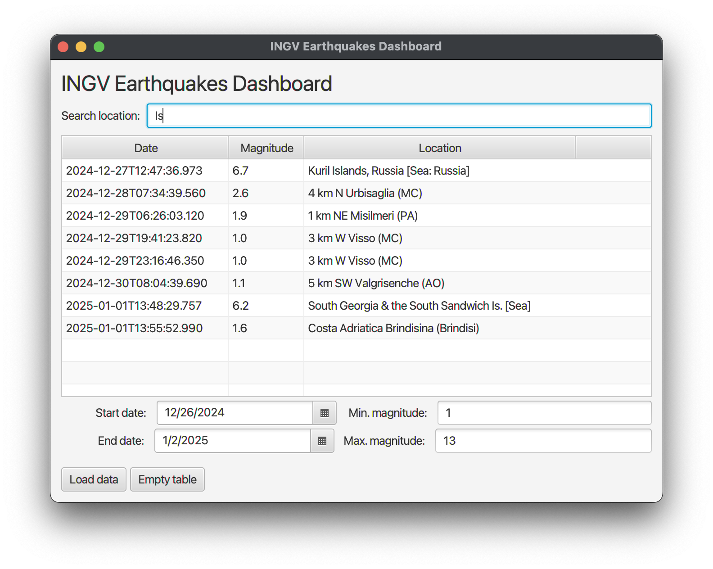

# 🌍📊 INGV Earthquakes Dashboard

A simple JavaFX application for visualizing and filtering event data by date, location, and magnitude.



## ✨ Features

- 🚀 Load event data from an external source (precisely, from an URL).
- 🔍 Filter events by:
  - 📅 Date range.
  - 📍 Location (via a search box).
  - 🫨 Magnitude range.
- 📋 Interactive table view.

## 📦 Requirements

- **Java 8** or later.
- **JavaFX** (comes with JDK 8 or requires a module in later JDK versions).

## How to Run

1. Clone the repository:
   ```bash
   git clone https://github.com/francescopeluso/INGV-Dashboard.git
   ```
2. Open the project in your IDE (e.g. IntelliJ IDEA, NetBeans, Eclipse).
3. Build the project and run the main class.

---

This project was created as homework for my Object-Oriented Programming (OOP) university class. 🎓💻 \
Let me know if this repo was helpful to you, maybe even adding a star. 🥳⭐

---

Made by Francesco Peluso 👨🏻‍💻 - [ [personal email](mailto:francesco.peluso04@gmail.com) | [uni email](f.peluso29@studenti.unisa.it) ]
